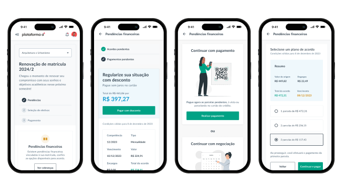
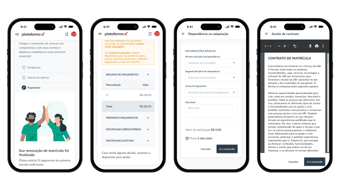
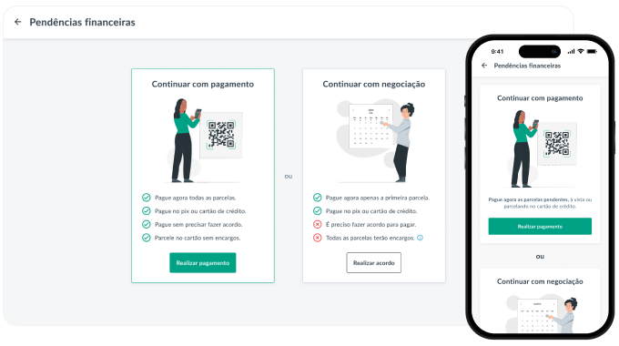
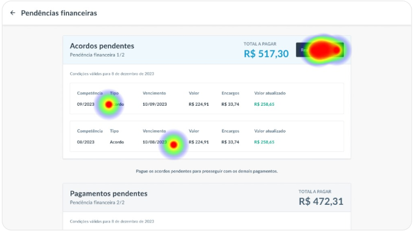
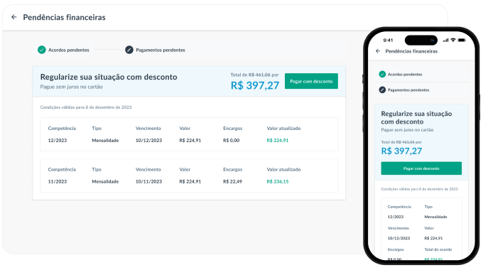

# Payment of outstanding fees
Optimizing the process for students to pay outstanding tuition fees before re-enrolling for the next term.

- **Timeline** 1 month.
- **My role** Product Designer, UX Researcher, Recruiter.
- **Team** The product owner and I.
- **Goals** Design a flow that allows students to settle their outstanding debts and complete their re-enrollment.

---

## About the project
I designed the <mark>entire re-enrollment flow</mark>, including the part showcased in this case study as well as the back-office configuration section.

Some elements and colors appearing on the pages are pre-existing components from the Design System, which I utilized in the best possible layout. The cards "Proceed to Payment" or "Proceed to Negotiation" were designed by me and are not part of the Design System.

<small>Simplified payment journey for outstanding fees for re-enrollment.</small>

<small>Other screens of the re-enrollment journey.</small>

---

## Clarifying payment vs negotiation flow
The stakeholders were uncertain if users would understand the difference between choosing "Proceed to Payment" or "Proceed to Negotiation".
  

---

## Usability Testing
Using Maze, two unmoderated usability tests were conducted: one with the previous version and one with the new version, to test navigation fluidity and differences.

One of the post-test questions validated what the journey recordings also indicated: <mark>100% of participants said they felt very confident or confident about choosing</mark> between "Proceed to Payment" or "Proceed to Negotiation", and the subsequent page aligned with their expectations from that choice.

Regarding participant recruitment, it wasn't too difficult as these users were employees of the company and students from a partner university.

<mark>However, an unexpected problem arose:</mark> in addition to some misclicks, some users reported confusion on this screen due to two payment boxes appearing consecutively.

---

## Proposed solution
Utilize a step-by-step pattern to avoid confusing users about the existence of two separate yet sequential payments.

---