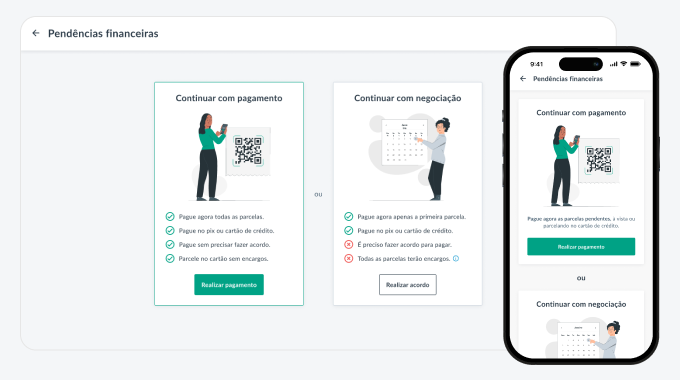

Tadeu Garcia
     

# Senior Product Designer based in Rio de Janeiro

Experienced designer specializing in creating digital products for e-commerce, marketplaces, billing and payment systems, as well as back-office applications. Skilled in developing web components for desktop and mobile platforms, with expertise in Material Design for app interfaces.

Brazilian, obtaining Spanish citizenship by end-2024.

## Work cases
Relevant experience from last years

### Premium Posgraduate Redesign
In this redesign, the navigation flow and the entire course purchase process were completely renewed.
[View case](case-1.html)

### Payment of outstanding fees
Streamlining the process for students to pay outstanding tuition fees before re-enrolling for the next term.
[View case](case-2.html)

## More about me

- Started designing in 2007 with an online forum signature contest.
- AI enthusiast, I utilize Artificial Intelligence daily to assist me with work and personal tasks.
- To proceed with the hipster designer checklist, I'm vegetarian.
- My current hobbies are swimming, yoga, and meditation.

## Acessibility and code 

What sets me apart is a long-standing interest in understanding the background workings of interfaces.

In my previous role, one of the directors there, who was also a developer and a blind person, taught me so much about **accessibility: from best practices to using screen readers**, it was an incredible learning with him.

## You can find me over here