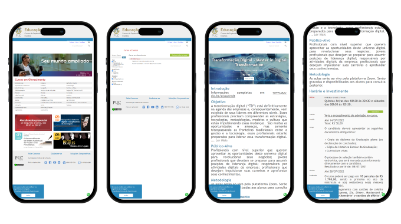
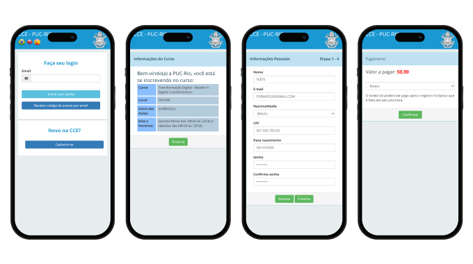

# Premium Posgraduate Redesign

The navigation flow and the entire course purchase process were completely renewed.

- **Timeline** 3 months (May - July 2022)
- **My role** Product Designer, UX Researcher
- **Team** The product manager and I
- **Goals** Redesign the course purchase experience to highlight their premium offering.
- **Constraints** Available time. This was a project I worked on during spare time intervals while engaged with my squad's main project.

*8 min read*

---

## What were the problems?

---

I need to highlight these <mark>very important words</mark>.

